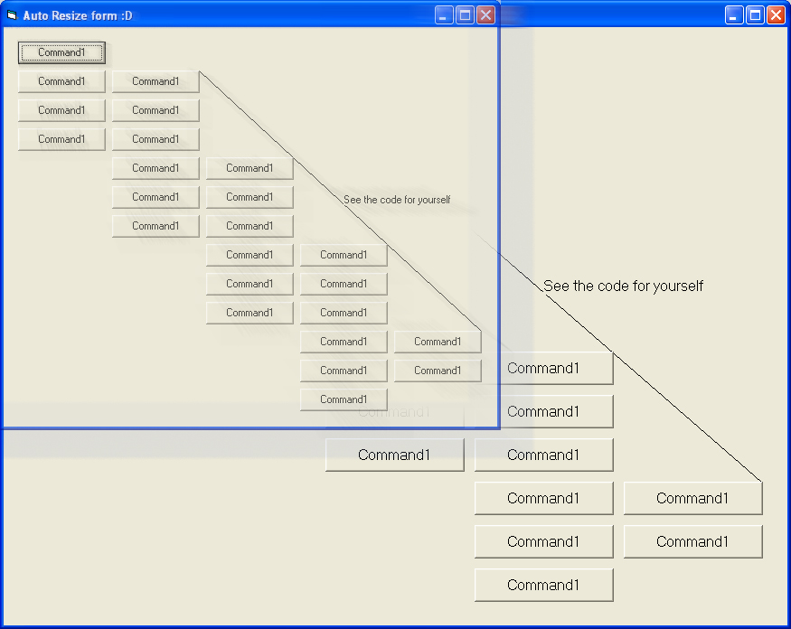



## Autosizer\!

### Description

Yes People.... This solves most of your form resizing needs. With this small yet robust control added to your form,all the fellow controls are resized/positioned according to their initial position/size. :) feel free to use it without leaving any credit :)

Regardz,

Ali Ashraf :)

n yea, plz leave a comment :) appreciate that :)
 
### More Info
 

             |
---                |---
**Submitted On**   |2010-09-29 08:00:02
**By**             |[Xelon Labs](https://github.com/Planet-Source-Code/PSCIndex/blob/master/ByAuthor/xelon-labs.md)
**Level**          |Beginner
**User Rating**    |4.8 (43 globes from 9 users)
**Compatibility**  |VB 6\.0
**Category**       |[Custom Controls/ Forms/  Menus](https://github.com/Planet-Source-Code/PSCIndex/blob/master/ByCategory/custom-controls-forms-menus__1-4.md)
**World**          |[Visual Basic](https://github.com/Planet-Source-Code/PSCIndex/blob/master/ByWorld/visual-basic.md)
**Archive File**   |[Autosizer\!2189469292010\.zip](https://github.com/Planet-Source-Code/xelon-labs-autosizer__1-73482/archive/master.zip)

